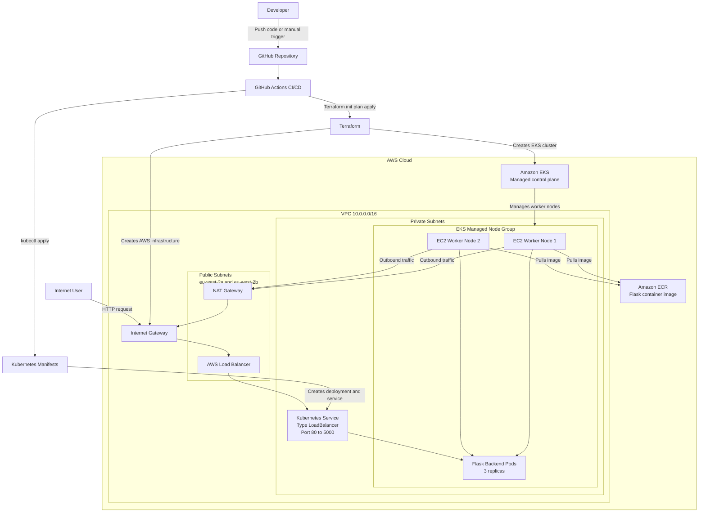

🚀 Cloud-Native DevOps Pipeline with AWS EKS & Terraform

📌 Overview

Designed and implemented an end-to-end cloud-native DevOps pipeline on AWS, leveraging Terraform for infrastructure provisioning and GitHub Actions for CI/CD automation to deploy a containerised backend application on Kubernetes (EKS).

This project demonstrates real-world DevOps practices, including infrastructure automation, Kubernetes orchestration, and pipeline-driven deployments.

🏗️ Architecture

## Architecture

⚙️ Tech Stack
 
| Category      | Technology               |
| ------------- | ------------------------ |
| Cloud         | AWS (EKS, VPC, IAM, ELB) |
| IaC           | Terraform                |
| Container     | Docker                   |
| Orchestration | Kubernetes               |
| CI/CD         | GitHub Actions           |
| Backend       | Flask (Python)           |

🔄 CI/CD Pipeline

Implemented a two-stage CI/CD pipeline:

✅ CI (Continuous Integration)
    Terraform initialization (terraform init)
    Code formatting validation (terraform fmt)
    Configuration validation (terraform validate)

🚀 CD (Continuous Deployment - Manual Trigger)
    Infrastructure planning (terraform plan)
    Infrastructure provisioning (terraform apply)

    This ensures safe, controlled infrastructure changes while maintaining automation.

☁️ Infrastructure Provisioning

Provisioned entirely via Terraform:

    Custom VPC (10.0.0.0/16)
    Public & private subnets across AZs
    Amazon EKS cluster (nextwork-eks-cluster)
    Managed node group (t3.medium)
    IAM roles & policies for cluster access

🚢 Kubernetes Deployment

    Deployed Flask backend using Kubernetes manifests
    Exposed service using LoadBalancer
    Verified external access via AWS ELB endpoint

📸 Key Evidence

    ✅ EKS cluster active and healthy
    ✅ Worker nodes in Ready state
    ✅ Pods running successfully
    ✅ Service exposed via LoadBalancer
    ✅ API returning successful responses
    ✅ CI/CD pipeline execution (GitHub Actions)

🧠 Key Achievements

    Built a production-style DevOps pipeline from scratch
    Automated AWS infrastructure provisioning using Terraform
    Successfully deployed and exposed a Kubernetes-based application
    Resolved real-world issues (IAM auth, kubeconfig, service exposure)
    Integrated CI/CD workflows for infrastructure lifecycle management

🧹 Cleanup Strategy

    Infrastructure managed via Terraform for reproducibility
    Resources safely destroyed after validation to optimise cost

🔮 Future Enhancements

    Integrate Docker image build & push to ECR
    Add security scanning (e.g., Trivy) in CI pipeline
    Implement monitoring (Prometheus + Grafana)
    Use Helm for scalable Kubernetes deployments
    Introduce GitOps (ArgoCD)

